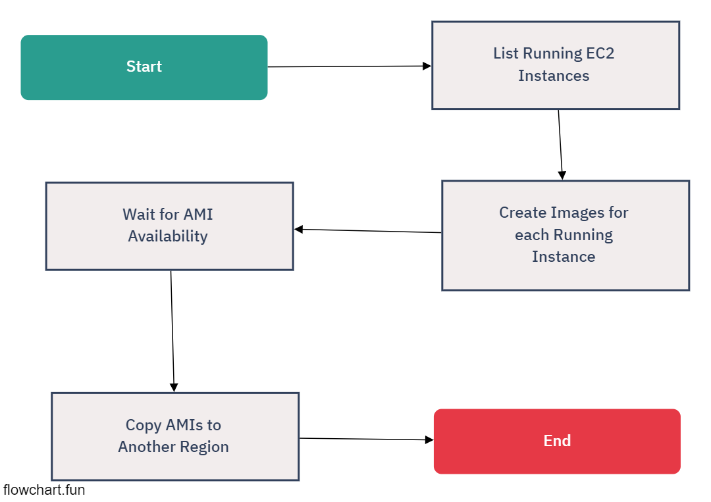

# CROSS REGION AMI DUPLICATOR

## Description
This Python project is designed to manage Amazon EC2 instance images. It automates the process of listing running EC2 instances, creating images (AMIs) from these instances, and then copying these AMIs to a different AWS region.

## Features
- **List Running EC2 Instances**: Retrieves a list of all running EC2 instances.
- **Create Images**: Automatically creates an AMI for each running instance.
- **Copy Images to Another Region**: Copies the created AMIs from the current region to another specified AWS region.

## Requirements
- AWS SDK for Python (Boto3)
- AWS credentials configured (with necessary permissions to manage EC2 instances and AMIs)

## Usage
1. **List Running Instances**: The script starts by listing all the running EC2 instances in the specified region.
2. **Create Images**: For each running instance, an AMI is created with a name pattern 'test-image' followed by the instance ID.
3. **Wait for Image Availability**: The script waits until the newly created AMIs are available.
4. **Copy Images**: Copies each of the created AMIs to the specified destination region ('us-east-1' by default).

## Configuration
- The AWS region for the source instances and the target region for copying AMIs can be configured in the script.
- AWS credentials should be configured as per the AWS SDK guidelines.

## Note
Ensure that the AWS credentials used have the necessary permissions for the operations performed by the script.

