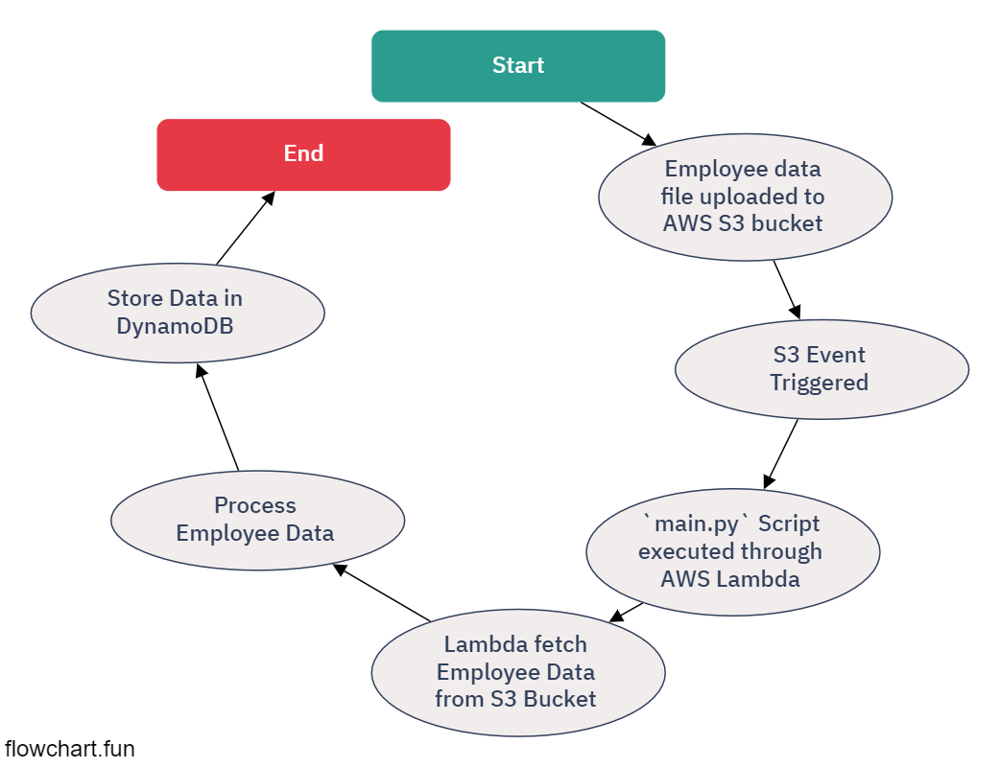

# Python Project: Employee Data Management

## Overview
This Python project is designed to process employee data and store it in a DynamoDB table. The main functionality is implemented in `main.py`. 

## Files
- `main.py`: Python script that reads employee data from an S3 bucket, processes it, and stores it in a DynamoDB table.
- `employees.csv`: Sample data file containing employee information.

## Functionality
- The script reads an employee data file from an S3 bucket triggered by an event.
- It processes each line of the file, which contains employee details.
- The data is then stored in a DynamoDB table.

## Data Format
- The `employees.csv` file is expected to have data in the following format: `id,name,location`.
- Each line represents an employee's data.

## AWS Services Used
- S3: For storing and retrieving the employee data file.
- DynamoDB: For storing processed employee data.
- Boto3: AWS SDK for Python to interact with AWS services.

## Requirements
- AWS account and appropriate permissions to read from S3 and write to DynamoDB.
- Python environment with Boto3 installed.

## Usage
1. Upload the employee data file to the specified S3 bucket.
2. The script is triggered by this upload event.
3. Processed data is stored in the DynamoDB table.

> Note: This README assumes that AWS resources like S3 buckets and DynamoDB tables are already configured.
