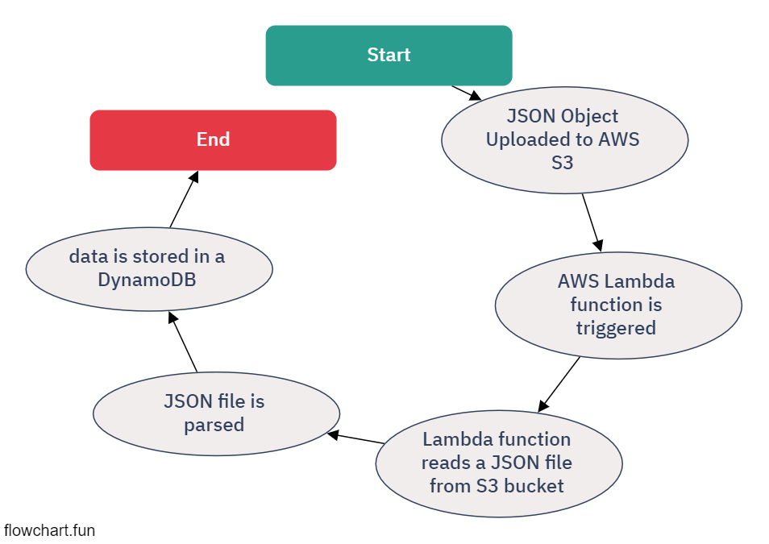

# Python AWS Lambda Project

## Overview
This project consists of a Python script designed to be deployed as an AWS Lambda function. The function is triggered by an event, processes data from an S3 bucket, and stores it in an AWS DynamoDB table.



## Files
- `main.py`: The main Python script for the AWS Lambda function.
- `data.json`: A sample data file representing the structure of data the Lambda function processes.

## Functionality
- The Lambda function is triggered by an event that includes details about an S3 bucket and an object key.
- It reads a JSON file from the specified S3 bucket.
- The JSON data is then parsed and stored in a DynamoDB table named 'employees'.

## Sample Data Structure
The `data.json` file contains sample data in the following format:
```json
{
    "emp_id": "3",
    "Name": "Hari",
    "Age": 26,
    "Location": [
        "USA"
    ]
}
```

## Requirements
- AWS SDK for Python (Boto3)
- An AWS account with access to S3, Lambda, and DynamoDB services.

## Deployment
To deploy this function:
1. Set up an S3 bucket and a DynamoDB table as per the configuration in `main.py`.
2. Deploy the `main.py` script as an AWS Lambda function.
3. Configure the Lambda function to trigger on an S3 event.

Note: Modify the script to suit the specific AWS configuration as necessary.
